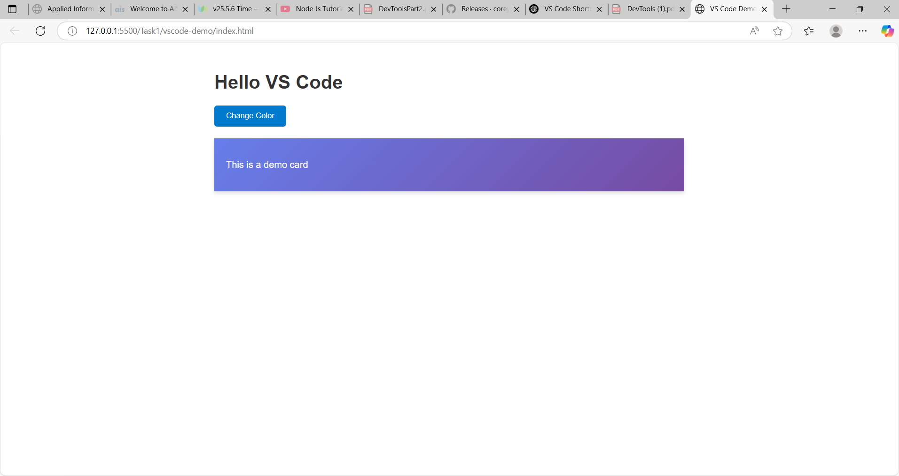
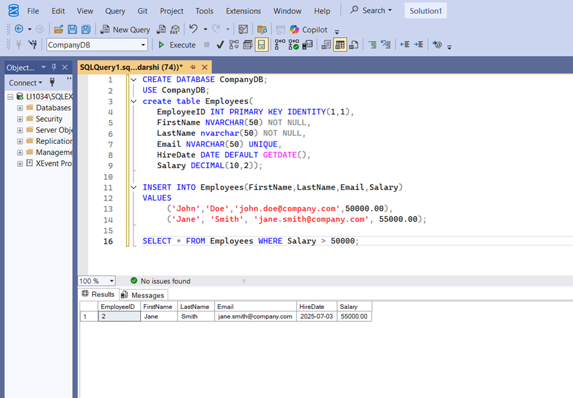

### Development Tools 1:
## Task 1: VS Code Setup

1. **Install All Essential Extensions** .
🧩 Essential VS Code Extensions Installed

- Prettier - Code formatter
- Auto Rename Tag
- Live Server
- Thunder Client (API testing)
- JavaScript (ES6) code snippets
- Bracket Pair Colorizer 2
- Material Icon Theme
- One Dark Pro (theme)

2. **Practice Using Keyboard Shortcuts**.

| Shortcut            | Action                                 |
|---------------------|----------------------------------------|
| `Ctrl + P`          | Quick file navigation                  |
| `Ctrl + Shift + P`  | Open command palette                   |
| `Ctrl + ~`          | Toggle terminal                        |
| `Alt + Click`       | Multi-cursor editing                   |
| `Ctrl + /`          | Comment/uncomment line                 |
| `Ctrl + B`          | Toggle sidebar                         |
| `F8`                | Jump to next error or warning          |
| `F5`                | Run current script (with debugger)     |
| `Ctrl + F`          | Find                                   |
| `Ctrl + H`          | Replace                                |
| `Ctrl + Shift + F`  | Find in files                          |
| `Ctrl + G`          | Go to line                             |

3. **Set Up Live Server Extension** and test it with a basic HTML file.
📄 Description
index.html: Contains the structure of the web page. style.css: Styles the web page with custom fonts, colors, layouts, etc. script.js: Adds dynamic behavior and interactivity to the web page.

🚀 Getting Started
Clone the repository or download the files.
Open index.html in a web browser.
Make changes in style.css or script.js as needed.
This is a simple front-end template meant for learning or quick prototyping.

## Task 2: Database Setup & Operations

🛠️ Tools Installed

- **SQL Server**: Installed and configured for local use.
- **SQL Server Management Studio (SSMS)**: Installed and used for executing SQL commands.

# Brief Summary of SSMS Features Explored

Object Explorer	- Used to connect to your SQL Server instance and navigate to CompanyDB, tables, etc.
Query Editor	- Used to write and execute SQL statements like CREATE, INSERT, and SELECT.
Results Grid	- Displayed the output of SELECT queries, showing employee records.
Messages Pane	- Displayed confirmation messages (e.g., "Command(s) completed successfully") and errors.
IntelliSense	- Helped auto-complete SQL commands and provided tooltips for functions like GETDATE().

