### Development Tools 1:
## Task 1: VS Code Setup

1. **Install All Essential Extensions** .
🧩 Essential VS Code Extensions Installed

- Prettier - Code formatter
- Auto Rename Tag
- Live Server
- Thunder Client (API testing)
- JavaScript (ES6) code snippets
- Bracket Pair Colorizer 2
- Material Icon Theme
- One Dark Pro (theme)

2. **Practice Using Keyboard Shortcuts**.

| Shortcut            | Action                                 |
|---------------------|----------------------------------------|
| `Ctrl + P`          | Quick file navigation                  |
| `Ctrl + Shift + P`  | Open command palette                   |
| `Ctrl + ~`          | Toggle terminal                        |
| `Alt + Click`       | Multi-cursor editing                   |
| `Ctrl + /`          | Comment/uncomment line                 |
| `Ctrl + B`          | Toggle sidebar                         |
| `F8`                | Jump to next error or warning          |
| `F5`                | Run current script (with debugger)     |
| `Ctrl + F`          | Find                                   |
| `Ctrl + H`          | Replace                                |
| `Ctrl + Shift + F`  | Find in files                          |
| `Ctrl + G`          | Go to line                             |

3. **Set Up Live Server Extension** and test it with a basic HTML file.
📄 Description
index.html: Contains the structure of the web page. style.css: Styles the web page with custom fonts, colors, layouts, etc. script.js: Adds dynamic behavior and interactivity to the web page.

🚀 Getting Started
Clone the repository or download the files.
Open index.html in a web browser.
Make changes in style.css or script.js as needed.
This is a simple front-end template meant for learning or quick prototyping.

## Task 2: Database Setup & Operations

🛠️ Tools Installed

- **SQL Server**: Installed and configured for local use.
- **SQL Server Management Studio (SSMS)**: Installed and used for executing SQL commands.

# Brief Summary of SSMS Features Explored

Object Explorer	- Used to connect to your SQL Server instance and navigate to CompanyDB, tables, etc.
Query Editor	- Used to write and execute SQL statements like CREATE, INSERT, and SELECT.
Results Grid	- Displayed the output of SELECT queries, showing employee records.
Messages Pane	- Displayed confirmation messages (e.g., "Command(s) completed successfully") and errors.
IntelliSense	- Helped auto-complete SQL commands and provided tooltips for functions like GETDATE().

# 🗂️ Task 3: GitHub Version Control (VS Code Terminal)

## ✅ Objective
- Create a GitHub repo
- Perform Git operations from VS Code terminal (`init`, `add`, `commit`, `push`, `pull`)

## 🚀 Git Workflow (Step-by-Step)

1. **Connect withInit Git**
   git init
   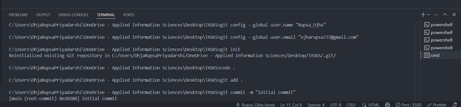
2. **Add + Commit Changes**
   git add .
   git commit -m "Initial commit"

3. **Create GitHub Repo**
   https://github.com/Rupsa1234/task3-github.git

4. **Connect Local to GitHub**
   git remote add origin https://github.com/Rupsa1234/task3-github.git
   git branch -M main
   git push -u origin main
   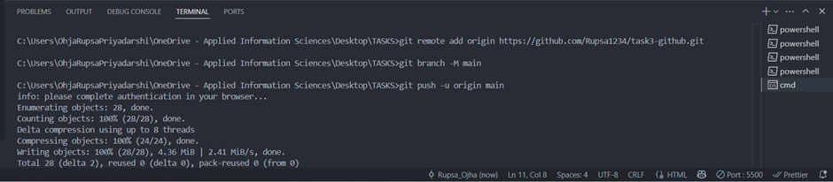
5. **Pull Remote Changes**
   git pull origin main
   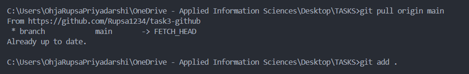
6. **commit and push**
   git add .
   git commit -m "Updated something"
   git push origin main
   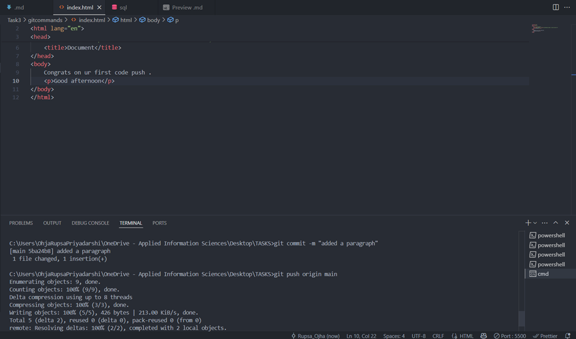

   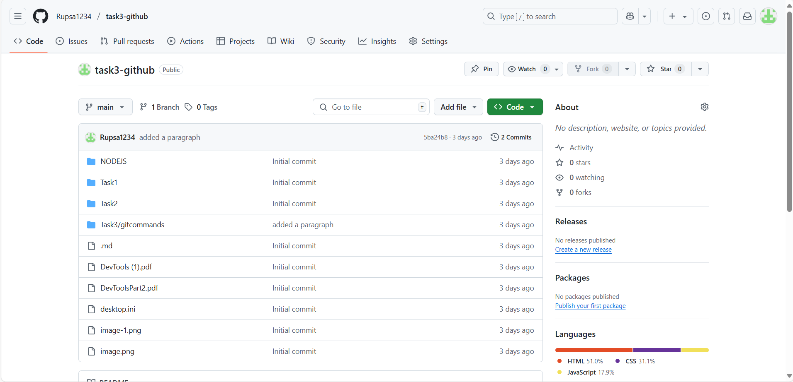

# 🚀 Task 4: Node.js Ecosystem Setup

## 📌 What I Did
- ✅ Installed Node.js using official installer
- ✅ Installed NVM (Node Version Manager)
- ✅ Practiced NPM commands
- ✅ Installed and used Nodemon for auto-reloading
- ✅ Documented my workflow and commands

## 🛠️ Installation Steps

# ✅ Node.js (via Official Installer)
choco install nodejs

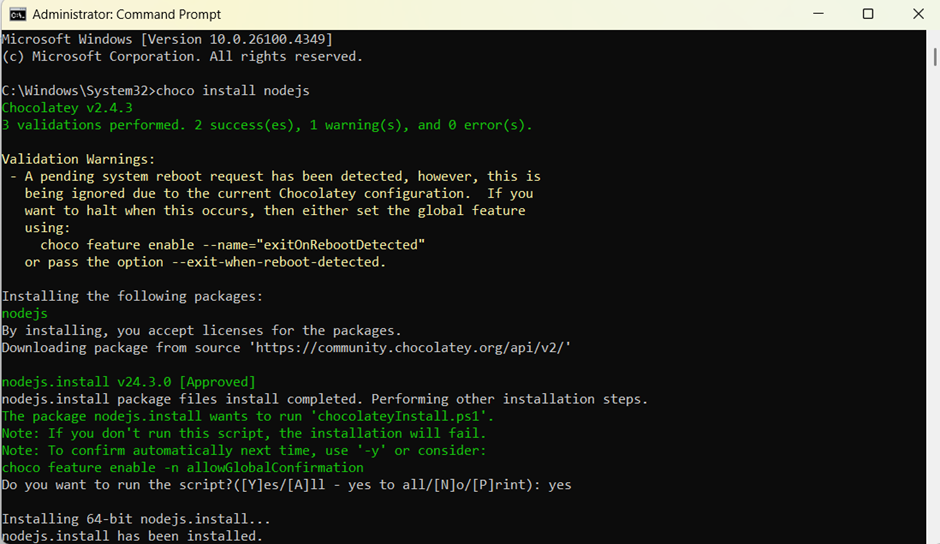

node --version  

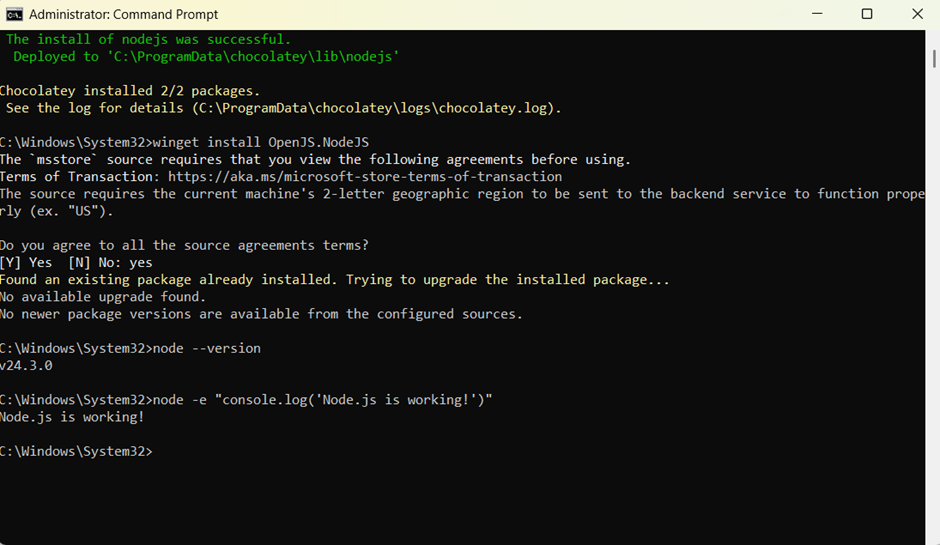

## Essential NPM Commands:
# Project Setup

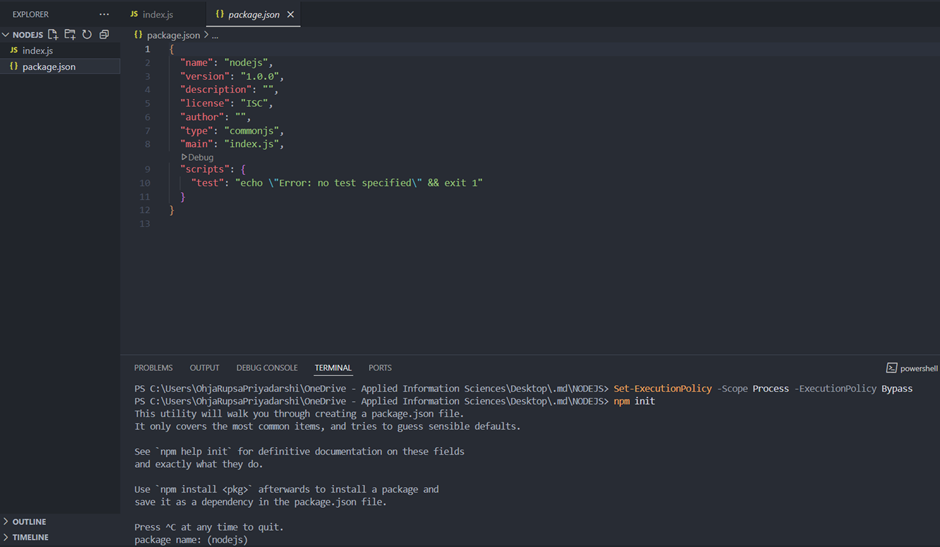

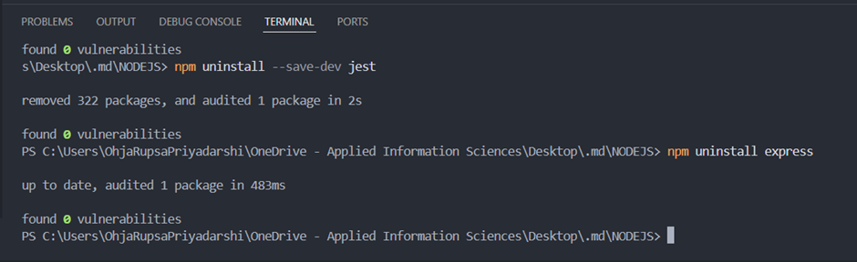

# Information Commands:

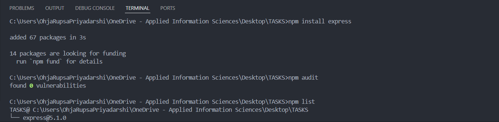

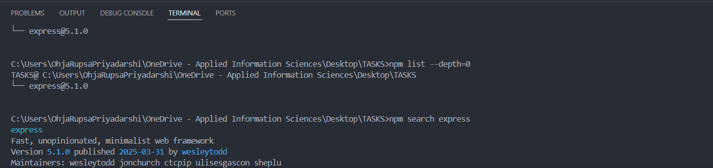

## NVM (Node Version Manager):
# Installation and Setup

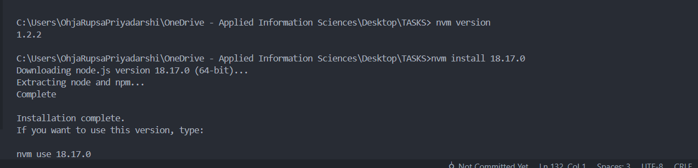

## Essential NPX Commands:
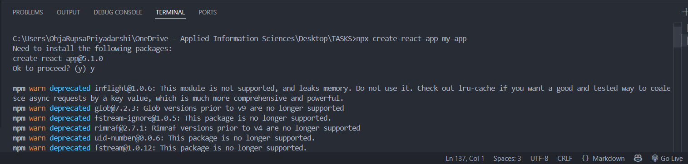

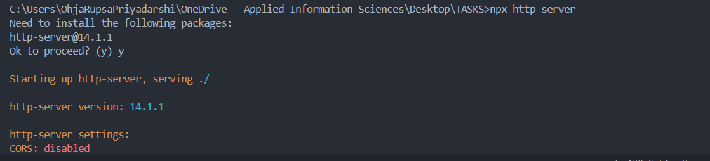

# Code generators
npx express-generator my-api # Express.js boilerplate
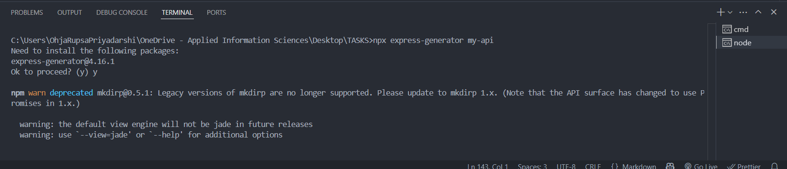

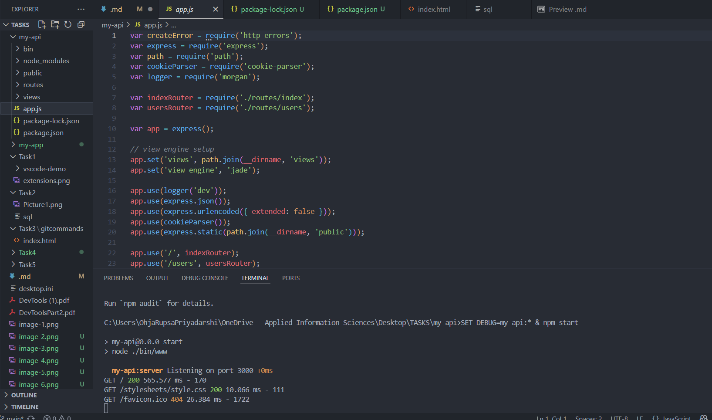

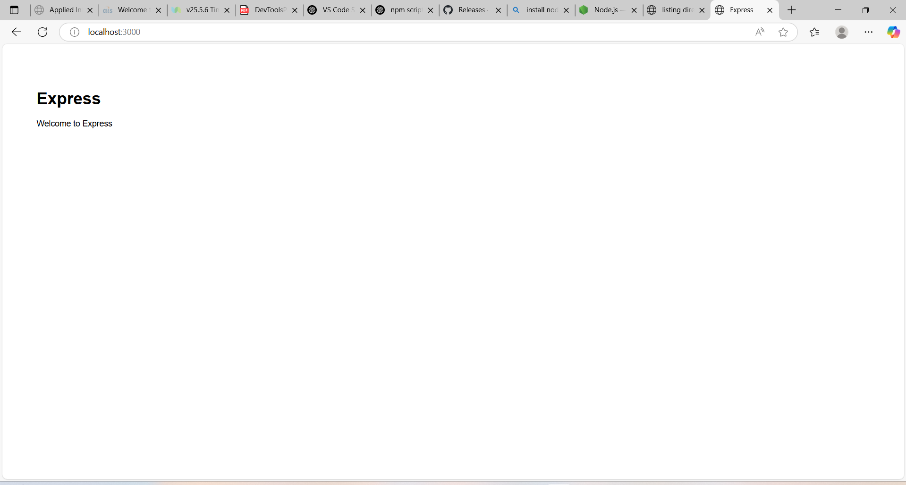

npx create-vue@latest my-vue-app

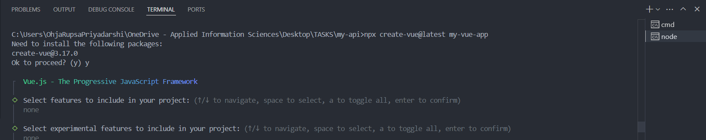

 cd my-vue-app
 npm install
 npm run dev

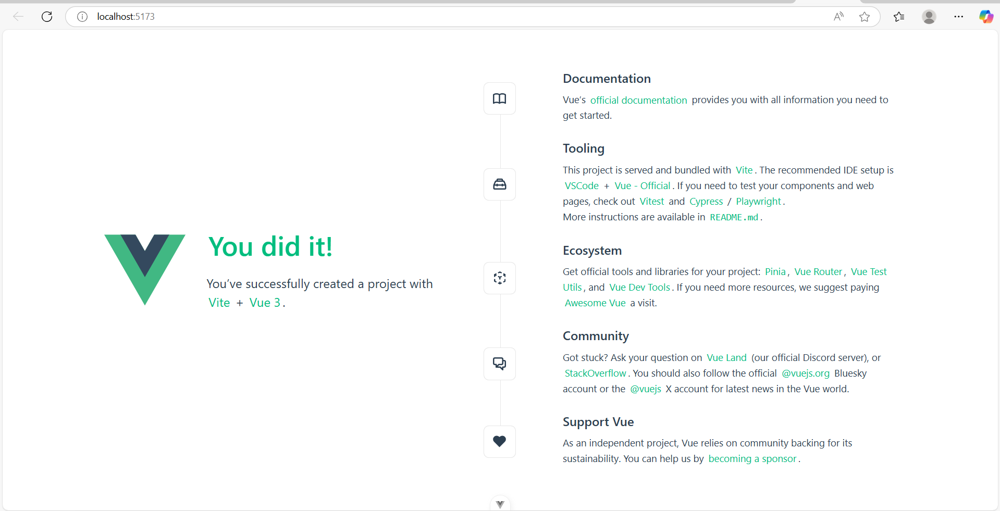

npx cowsay "Hello World" 

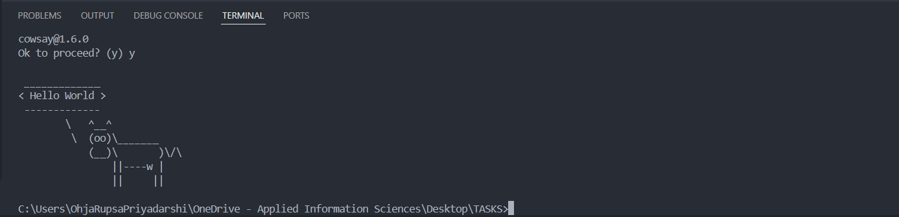

# Local vs Global:
npm install -g create-react-app
cd my_systemapp
npm start

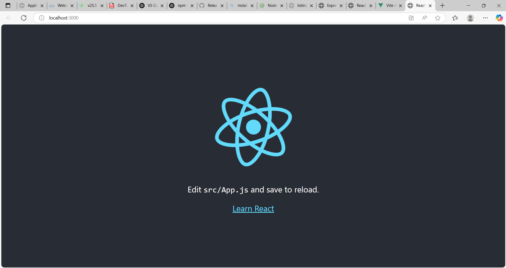

# Nodemon
npm install -g nodemon

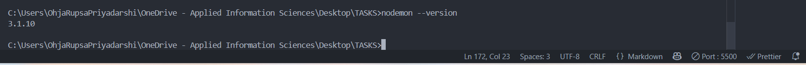

### Task 5: Technical Documentation

## Create the Flowchart in Draw.io 

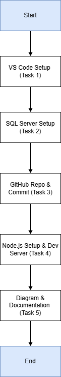

## Create System architecture

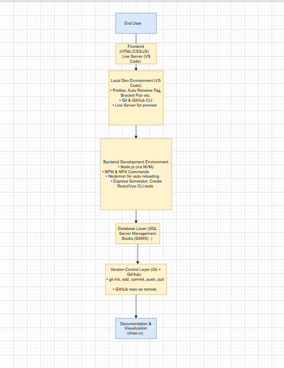

##  Learning Summary

Through this development tools setup journey, I gained hands-on experience with essential tools like VS Code, SQL Server, GitHub, and Node.js. I learned to manage versions effectively using NVM, automate server restarts with Nodemon, and streamline development using NPM/NPX commands. I overcame common issues like Git push errors, Node version mismatches, and confusion between global vs local installs. Exploring SSMS deepened my understanding of databases, while draw\.io helped me visualize system architecture clearly. This setup process enhanced both my technical workflow and debugging skills, preparing me for full-stack development tasks.

Challenge	 :                                                      How I Solved It     :
Didn’t know what SSMS features to explore         Explored Object Explorer, Results Grid, Execution Plan, and shortcuts
Node.js version issues	                          Installed NVM to manage and switch between different Node.js versions easily
Git push errors	                                Resolved by using terminal commands instead of GUI and setting upstream
NPM audit error	                                Fixed it by running npm install --package-lock-only to generate a lockfile
Confused between global vs local install          Used npx for one-time runs like create-react-app instead of global install
Confusion while using Draw.io	                    Explored the template section and watched a short video to understand how it works
Nodemon not working                               Used npm install --save-dev nodemon, updated scripts in package.json, and used npm run dev.